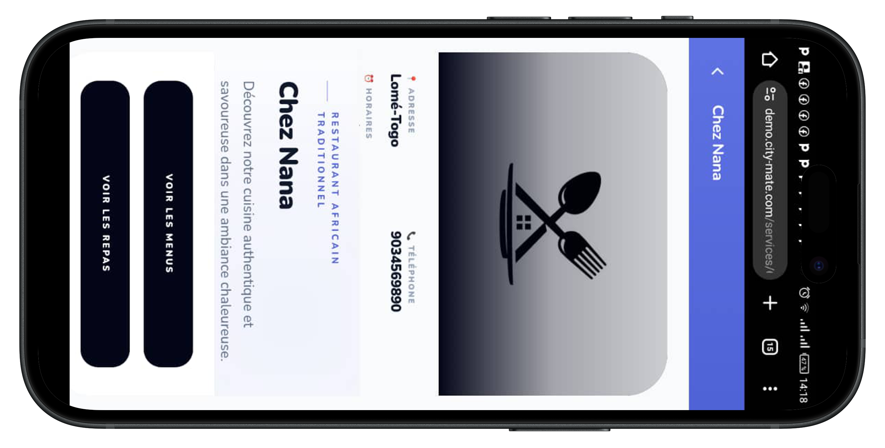
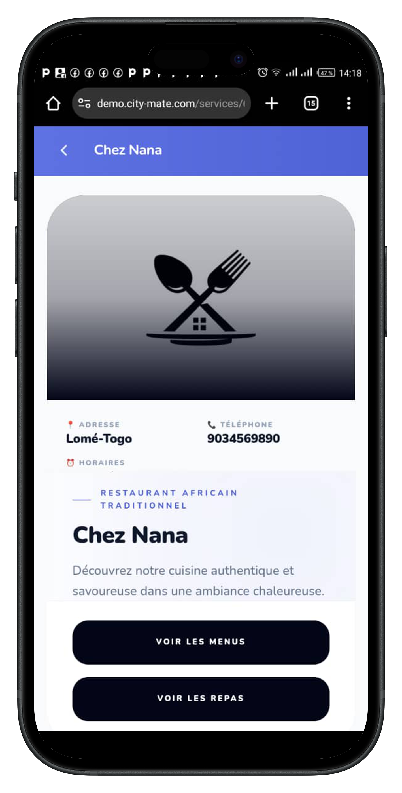
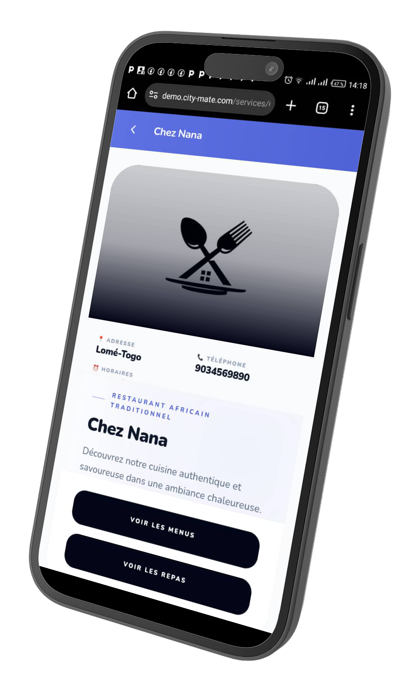

<p align="center">
  
</p>

<h1 align="center"> Zamora</h1>

<p align="center">
  <strong>Solution Web de Gestion des Repas de Restaurant</strong><br/>
  <em>Commandez vos plats préférés — Au restaurant ou chez vous</em>
</p>

<p align="center">
  <a href="http://zamora-app.netlify.app/">
    
  </a>
  <a href="https://github.com/lennysmicky/zamora">
    
  </a>
</p>

<p align="center">
  
  
  
  
  
  
  
  
</p>

---

##  Table des matières

- [À propos](#-à-propos)
- [Démo](#-démo)
- [Fonctionnalités](#-fonctionnalités)
- [Captures d'écran](#-captures-décran)
- [Architecture du projet](#-architecture-du-projet)
- [Technologies utilisées](#-technologies-utilisées)
- [Installation](#-installation)
- [Structure du projet](#-structure-du-projet)
- [API & Backend](#-api--backend)
- [Internationalisation](#-internationalisation)
- [Déploiement](#-déploiement)
- [Équipe](#-équipe)
- [Licence](#-licence)

---

##  À propos

**Zamora** est une solution web complète de gestion de restaurant développée dans le cadre du projet **CityMate**. Elle permet aux **administrateurs** et **restaurateurs** de gérer efficacement leurs restaurants, menus, commandes, paiements et promotions via une interface moderne et intuitive.

La plateforme offre également un rendu mobile via le **SDK CityMate**, permettant aux clients finaux de :
-  Scanner un QR code au restaurant pour commander directement
-  Commander depuis chez eux via l'application mobile
-  Suivre leurs commandes en temps réel
-  Payer de manière sécurisée

### Contexte

La digitalisation de la restauration est devenue essentielle pour améliorer la gestion des commandes, la communication avec les clients et le suivi des ventes. Les restaurateurs ont besoin d'une solution web complète pour gérer leurs repas, commandes et promotions, tandis que les clients finaux attendent une interface mobile fluide et ergonomique pour passer des commandes et suivre leur livraison.

---

##  Démo

| Environnement | Lien |
|---|---|
|  **Application Live** | [zamora-app.netlify.app](http://zamora-app.netlify.app/) |
|  **Code Source** | [github.com/lennysmicky/zamora](https://github.com/lennysmicky/zamora) |

### Comptes de démonstration

| Rôle | Email | Mot de passe |
|---|---|---|
|  Admin | `admin@zamora.com` | `password` |
|  Restaurant | `restaurant@zamora.com` | `password` |

>  *Les identifiants de démonstration peuvent varier. Consultez la documentation interne si nécessaire.*

---

##  Fonctionnalités

###  Panel Administrateur

| Fonctionnalité | Description |
|---|---|
|  **Dashboard** | Tableau de bord avec KPIs, graphiques de revenus et commandes |
|  **Gestion Restaurants** | CRUD complet des restaurants partenaires |
|  **Gestion Menus** | Administration des menus, catégories et repas |
|  **Gestion Commandes** | Suivi en temps réel, filtres avancés, détails complets |
|  **Gestion Utilisateurs** | Gestion des comptes et rôles |
|  **Gestion Clients** | Base de données clients avec historique |
|  **Promotions** | Création et gestion de codes promotionnels |
|  **Offres Spéciales** | Offres limitées avec suivi de performance |
|  **Paiements** | Transactions, filtres, exports et configuration |
|  **Messages** | Messagerie avec les restaurants et annonces globales |
|  **Notifications** | Notifications temps réel via Pusher |
|  **Gestion Tables** | Tables avec génération de QR codes |
|  **Paramètres** | Profil, sécurité et configuration du compte |

###  Panel Restaurateur

| Fonctionnalité | Description |
|---|---|
|  **Dashboard** | Vue d'ensemble des performances du restaurant |
|  **Mon Menu** | Gestion des catégories, repas et menus |
|  **Mes Commandes** | Réception et traitement des commandes en temps réel |
|  **Mes Paiements** | Suivi des transactions et revenus |
|  **Mes Promotions** | Création de promotions pour mon restaurant |
|  **Offres Spéciales** | Offres exclusives limitées dans le temps |
|  **Messages** | Communication avec l'administration |
|  **Notifications** | Alertes temps réel nouvelles commandes |
|  **Mes Tables** | Configuration des tables et QR codes |
|  **Paramètres** | Configuration du restaurant |

###  Landing Page Client

-  Carousel d'images de plats avec transitions douces
-  Section téléchargement (Google Play & App Store)
-  Présentation des fonctionnalités et du fonctionnement
-  Section crédits de l'équipe
-  Liens d'inscription et connexion restaurateur

---

##  Captures d'écran

<p align="center">
  
</p>

<p align="center">
  <em>Dashboard administrateur avec KPIs et graphiques</em>
</p>

<p align="center">
  
  &nbsp;&nbsp;&nbsp;
  
</p>

<p align="center">
  <em>Rendu mobile de l'application</em>
</p>

---

##  Architecture du projet

```
┌─────────────────────────────────────────────┐
│                  CLIENT                      │
│            (React + Vite)                    │
│                                              │
│  ┌──────────┐ ┌──────────┐ ┌──────────┐    │
│  │  Pages   │ │Components│ │  Hooks   │    │
│  └────┬─────┘ └────┬─────┘ └────┬─────┘    │
│       │            │            │            │
│  ┌────▼────────────▼────────────▼─────┐     │
│  │           API Layer (Axios)         │     │
│  └────────────────┬───────────────────┘     │
│                   │                          │
├───────────────────┼──────────────────────────┤
│                   │                          │
│  ┌────────────────▼───────────────────┐     │
│  │        Backend (Laravel API)        │     │
│  │                                     │     │
│  │  ┌─────────┐  ┌─────────────────┐  │     │
│  │  │  Auth   │  │   Controllers   │  │     │
│  │  │ (JWT)   │  │   & Services    │  │     │
│  │  └─────────┘  └─────────────────┘  │     │
│  │                                     │     │
│  │  ┌─────────┐  ┌─────────────────┐  │     │
│  │  │ Pusher  │  │     MySQL       │  │     │
│  │  │Realtime │  │    Database     │  │     │
│  │  └─────────┘  └─────────────────┘  │     │
│  └─────────────────────────────────────┘     │
│                                              │
│                  SERVER                      │
└─────────────────────────────────────────────┘
```

### Flux de données

```
Client (React) ──HTTP──▶ API (Laravel) ──▶ MySQL
       ▲                      │
       │                      │
       ◀──── Pusher (WebSocket) ◀──┘
```

---

##  Technologies utilisées

### Frontend

| Technologie | Usage |
|---|---|
| **React 18** | Framework UI principal |
| **Vite** | Build tool et dev server |
| **React Router v6** | Routing et navigation |
| **Zustand** | State management (stores) |
| **Axios** | Requêtes HTTP vers l'API |
| **React Icons** | Bibliothèque d'icônes |
| **react-i18next** | Internationalisation (FR/EN) |
| **Pusher.js** | Notifications temps réel |
| **CSS Modules** | Styles modulaires |

### Backend

| Technologie | Usage |
|---|---|
| **Laravel 10** | Framework API REST |
| **MySQL 8** | Base de données relationnelle |
| **JWT Auth** | Authentification sécurisée |
| **Pusher** | WebSockets temps réel |
| **Laravel Sanctum** | Tokens API |

### DevOps & Outils

| Outil | Usage |
|---|---|
| **Netlify** | Hébergement frontend |
| **Git / GitHub** | Versioning et collaboration |
| **ESLint** | Linting du code |

---

##  Installation

### Prérequis

- **Node.js** >= 18.x
- **npm** >= 9.x ou **yarn** >= 1.22
- **Git**

### 1. Cloner le repository

```bash
git clone https://github.com/lennysmicky/zamora.git
cd zamora
```

### 2. Installer les dépendances

```bash
npm install
```

### 3. Configuration de l'environnement

Créer un fichier `.env` à la racine :

```env
VITE_API_BASE_URL=https://votre-api-backend.com/api
VITE_PUSHER_APP_KEY=votre_pusher_key
VITE_PUSHER_APP_CLUSTER=eu
```

### 4. Lancer le serveur de développement

```bash
npm run dev
```

L'application sera accessible sur `http://localhost:5173`

### 5. Build pour la production

```bash
npm run build
```

Les fichiers de production seront générés dans le dossier `dist/`.

### 6. Prévisualiser le build

```bash
npm run preview
```

---

##  Structure du projet

```
src/
├── api/                          # Couche API (Axios)
│   ├── client.js                 # Configuration Axios de base
│   ├── auth.js                   # Authentification
│   ├── restaurants.js            # CRUD restaurants
│   ├── menus.js                  # Gestion menus
│   ├── orders.js                 # Gestion commandes
│   ├── users.js                  # Gestion utilisateurs
│   ├── customers.js              # Gestion clients
│   ├── payments.js               # Transactions & paiements
│   ├── promotions.js             # Promotions
│   ├── specialOffers.js          # Offres spéciales
│   ├── notifications.js          # Notifications
│   ├── messages.js               # Messagerie
│   ├── dashboard.js              # Données dashboard
│   ├── settings.js               # Paramètres
│   └── tables.js                 # Gestion tables
│
├── assets/                       # Ressources statiques
│   ├── images/
│   │   ├── logo.png              # Logo Zamora
│   │   ├── food/                 # Images de plats
│   │   └── ...
│   └── team/                     # Photos de l'équipe
│
├── components/                   # Composants réutilisables
│   ├── charts/                   # Graphiques (Revenue, Orders)
│   ├── kpi/                      # Cartes KPI
│   ├── tables/                   # Tableaux de données
│   ├── menus/                    # Composants menus (Category, Meal, Menu)
│   ├── forms/                    # Formulaires
│   ├── orders/                   # Composants commandes
│   ├── payments/                 # Composants paiements
│   ├── messages/                 # Messagerie (conversations, bulles)
│   ├── Promotions/               # Composants promotions
│   ├── SpecialOffers/            # Composants offres spéciales
│   ├── dashboard/                # Top selling, Recent orders
│   ├── settings/                 # Sections paramètres
│   ├── notifications/            # Notifications temps réel
│   └── common/                   # Button, Modal, Spinner, Confirm
│
├── pages/                        # Pages de l'application
│   ├── Landing/                  # Landing page publique
│   ├── Auth/                     # Pages d'authentification
│   │   ├── Admin/                # Login admin
│   │   └── Restaurant/           # Login & Register restaurant
│   ├── Dashboard/                # Dashboard admin
│   ├── Restaurants/              # Gestion restaurants
│   ├── Menus/                    # Gestion menus admin
│   ├── Orders/                   # Commandes admin
│   ├── Users/                    # Utilisateurs
│   ├── Customers/                # Clients
│   ├── Promotions/               # Promotions admin
│   ├── SpecialOffers/            # Offres spéciales admin
│   ├── Payments/                 # Paiements admin
│   ├── Messages/                 # Messagerie admin
│   ├── Notifications/            # Notifications admin
│   ├── Tables/                   # Tables admin
│   ├── Settings/                 # Paramètres admin
│   └── Restaurant/               # Pages restaurateur
│       ├── Dashboard/
│       ├── Menu/
│       ├── Orders/
│       ├── Payments/
│       ├── Promotions/
│       ├── SpecialOffers/
│       ├── Messages/
│       ├── Notifications/
│       ├── Tables/
│       └── Settings/
│
├── hooks/                        # Custom React Hooks
│   ├── useAuth.js                # Authentification
│   ├── useOrders.js              # Logique commandes
│   ├── useDashboardData.js       # Données dashboard
│   ├── usePayments.js            # Logique paiements
│   ├── useMessages.js            # Logique messagerie
│   ├── useNotifications.js       # Logique notifications
│   ├── usePromotions.js          # Logique promotions
│   ├── useSpecialOffers.js       # Logique offres spéciales
│   ├── useRestaurantMenus.js     # Menus restaurant
│   ├── useRestaurants.js         # Logique restaurants
│   ├── useRestaurantSettings.js  # Paramètres restaurant
│   ├── useTables.js              # Logique tables
│   ├── usePusher.js              # Connexion Pusher
│   ├── useOrderNotifications.js  # Notifs commandes
│   └── useAutoRefresh.js         # Auto-refresh données
│
├── stores/                       # State management (Zustand)
│   ├── authStore.js              # État authentification
│   ├── ordersStore.js            # État commandes
│   └── dashboardFiltersStore.js  # Filtres dashboard
│
├── routes/                       # Configuration routing
│   ├── AppRouter.jsx             # Router principal
│   └── ProtectedRoute.jsx        # Route protégée (auth)
│
├── layout/                       # Layouts de l'application
│   ├── MainLayout.jsx            # Layout admin principal
│   ├── RestaurantLayout.jsx      # Layout restaurateur
│   ├── AuthLayout.jsx            # Layout authentification
│   ├── Header.jsx                # Header avec navigation
│   └── SideBar.jsx               # Sidebar navigation
│
├── i18n/                         # Internationalisation
│   ├── index.js                  # Configuration i18n
│   └── locales/
│       ├── fr.json               # Traductions françaises
│       └── en.json               # Traductions anglaises
│
├── utils/                        # Utilitaires
│   ├── date.js                   # Formatage dates
│   ├── format.js                 # Formatage données
│   ├── validators.js             # Validations
│   ├── dashboardEvents.js        # Événements dashboard
│   ├── ordersQuery.js            # Queries commandes
│   ├── resolveImageSrc.js        # Résolution URLs images
│   └── console.js                # Utilitaires console
│
├── filters/                      # Composants de filtrage
│   ├── DateRangeFilter.jsx       # Filtre par date
│   └── RestaurantSelector.jsx    # Sélecteur restaurant
│
├── services/                     # Services externes
│   └── pusher.js                 # Configuration Pusher
│
├── Providers/                    # Context Providers
│   └── NotificationProvider.jsx  # Provider notifications
│
├── styles/                       # Styles globaux
│   ├── globals.css
│   └── layout.css
│
├── config/                       # Configuration
│   └── env.js                    # Variables d'environnement
│
├── App.jsx                       # Composant racine
├── App.css                       # Styles App
├── main.jsx                      # Point d'entrée
├── index.css                     # Styles de base
└── push.js                       # Configuration push notifications
```

---

##  API & Backend

### Endpoints principaux

L'API REST communique via les modules définis dans `src/api/` :

| Module | Endpoints | Description |
|---|---|---|
| `auth.js` | `/login`, `/register`, `/logout` | Authentification JWT |
| `restaurants.js` | `/restaurants` | CRUD restaurants |
| `menus.js` | `/menus`, `/categories`, `/meals` | Gestion menus complets |
| `orders.js` | `/orders` | Commandes avec filtres |
| `users.js` | `/users` | Gestion utilisateurs |
| `customers.js` | `/customers` | Base clients |
| `payments.js` | `/payments`, `/transactions` | Paiements & transactions |
| `promotions.js` | `/promotions` | Codes promo |
| `specialOffers.js` | `/special-offers` | Offres limitées |
| `notifications.js` | `/notifications` | Notifications |
| `messages.js` | `/messages`, `/conversations` | Messagerie |
| `dashboard.js` | `/dashboard/stats` | Statistiques |
| `tables.js` | `/tables` | Tables & QR codes |
| `settings.js` | `/settings` | Configuration |

### Configuration API Client

```javascript
// src/api/client.js
import axios from 'axios';

const client = axios.create({
  baseURL: import.meta.env.VITE_API_BASE_URL,
  headers: {
    'Content-Type': 'application/json',
    'Accept': 'application/json'
  }
});

// Intercepteur pour ajouter le token JWT
client.interceptors.request.use((config) => {
  const token = localStorage.getItem('token');
  if (token) {
    config.headers.Authorization = `Bearer ${token}`;
  }
  return config;
});
```

### Temps réel avec Pusher

```javascript
// src/services/pusher.js
// Configuration Pusher pour les notifications en temps réel
// - Nouvelles commandes
// - Mises à jour de statut
// - Messages instantanés
```

---

##  Internationalisation

Zamora supporte **2 langues** :

| Langue | Fichier | Code |
|---|---|---|
| 🇫🇷 Français | `src/i18n/locales/fr.json` | `fr` |
| 🇬🇧 Anglais | `src/i18n/locales/en.json` | `en` |

### Utilisation dans les composants

```jsx
import { useTranslation } from 'react-i18next';

const MyComponent = () => {
  const { t } = useTranslation();
  return <h1>{t('dashboard.title')}</h1>;
};
```

---

##  Déploiement

### Frontend (Netlify)

L'application frontend est déployée sur **Netlify** :

| Paramètre | Valeur |
|---|---|
| **URL** | [zamora-app.netlify.app](http://zamora-app.netlify.app/) |
| **Build Command** | `npm run build` |
| **Publish Directory** | `dist` |
| **Node Version** | 18.x |

### Variables d'environnement Netlify

```
VITE_API_BASE_URL=https://api.zamora.com/api
VITE_PUSHER_APP_KEY=your_pusher_key
VITE_PUSHER_APP_CLUSTER=eu
```

### Déploiement automatique

Chaque `push` sur la branche `main` déclenche automatiquement un nouveau déploiement sur Netlify.

---

##  Équipe

<table align="center">
  <tr>
    <td align="center" width="220">
      <br/>
      <strong>Kossi michael ZODJEKPO</strong><br/>
      <sub> Project Lead & Développeur Fullstack</sub><br/>
      <em>Architecture, Frontend React & Backend API</em><br/><br/>
      <a href="https://linkedin.com/in/">
        
      </a>
      <a href="ttps://github.com/lennysmicky/">
        
      </a>
    </td>
    <td align="center" width="220">
      <br/>
      <strong>Koffi Kelly SOWU</strong><br/>
      <sub> Développeur Backend</sub><br/>
      <em>API REST, base de données & logique métier</em><br/><br/>
      <a href="https://linkedin.com/in/">
        
      </a>
      <a href="https://github.com/Sowu20">
        
      </a>
    </td>
    <td align="center" width="220">
      <br/>
      <strong>kossi enouagnon HOUNGBEDJI</strong><br/>
      <sub> Développeur Frontend</sub><br/>
      <em>Interfaces UI, responsive & expérience client</em><br/><br/>
      <a href="https://www.linkedin.com/in/kossi-enouagnon-houngbedji-475984288/">
        
      </a>
      <a href="https://github.com/">
        
      </a>
    </td>
    <td align="center" width="220">
      <br/>
      <strong>Sergio DAKLU</strong><br/>
      <sub> Développeur Backend</sub><br/>
      <em>Authentification, paiements & intégrations</em><br/><br/>
      <a href="https://www.linkedin.com/in/sergio-daklu-859a4734b/">
        
      </a>
      <a href="https://github.com/">
        
      </a>
    </td>
  </tr>
</table>

---

##  Statistiques du projet

| Métrique | Valeur |
|---|---|
|  **Fichiers JSX** | 100+ composants |
|  **Fichiers CSS** | 50+ fichiers de styles |
|  **Endpoints API** | 15 modules |
|  **Custom Hooks** | 17 hooks |
|  **Langues** | 2 (FR, EN) |
|  **Responsive** | Oui (Mobile, Tablet, Desktop) |
|  **Temps réel** | Pusher WebSockets |
|  **Auth** | JWT + Protected Routes |

---

##  Licence

Ce projet est sous licence **MIT**. Voir le fichier [LICENSE](LICENSE) pour plus de détails.

```
MIT License

Copyright (c) 2025 Zamora Team

Permission is hereby granted, free of charge, to any person obtaining a copy
of this software and associated documentation files (the "Software"), to deal
in the Software without restriction, including without limitation the rights
to use, copy, modify, merge, publish, distribute, sublicense, and/or sell
copies of the Software, and to permit persons to whom the Software is
furnished to do so, subject to the following conditions:

The above copyright notice and this permission notice shall be included in all
copies or substantial portions of the Software.

THE SOFTWARE IS PROVIDED "AS IS", WITHOUT WARRANTY OF ANY KIND, EXPRESS OR
IMPLIED, INCLUDING BUT NOT LIMITED TO THE WARRANTIES OF MERCHANTABILITY,
FITNESS FOR A PARTICULAR PURPOSE AND NONINFRINGEMENT.
```

---

<p align="center">
  
</p>

<p align="center">
  <strong>Zamora</strong> — Le vrai goût <br/>
  <em>Fait avec ❤️ par l'équipe Zamora</em>
</p>

<p align="center">
  <a href="http://zamora-app.netlify.app/">Demo</a> •
  <a href="https://github.com/lennysmicky/zamora">GitHub</a> •
  <a href="#-équipe">Équipe</a>
</p>
```